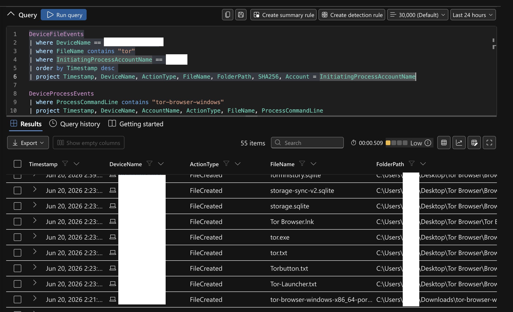
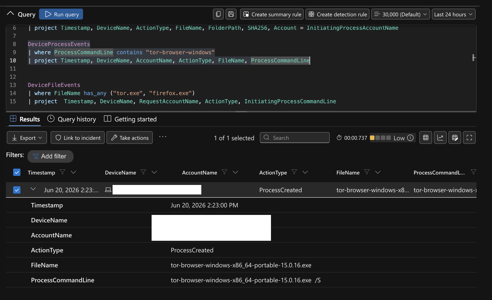

# Hunting Unauthorized TOR Browser Usage


A hands-on threat hunt run through Microsoft Defender for Endpoint. Management suspected employees were using the TOR browser to bypass network security controls, after seeing unusual encrypted traffic and connections to known TOR entry nodes. This hunt confirms whether TOR was installed and used on a workstation, and traces the activity across file, process, and network evidence.

> Note: hostnames and account names in this writeup and the evidence files have been sanitized. The real device name was replaced with `WIN-TARGET-01` and the user account with `user`. SHA256 hashes and TOR node IPs are kept as indicators.

| | |
|---|---|
| **Platform** | Microsoft Defender for Endpoint (Advanced Hunting) |
| **Query Language** | KQL |
| **Tactic** | Command and Control |
| **MITRE Technique** | T1090.003 Proxy: Multi-hop Proxy |
| **Outcome** | Unauthorized TOR install and use confirmed end to end. Escalated to management |

## Contents

- [Background](#background)
- [IoC Discovery Plan](#ioc-discovery-plan)
- [The Hunt](#the-hunt)
- [Findings](#findings)
- [Timeline](#timeline)
- [Indicators](#indicators)
- [MITRE ATT&CK Mapping](#mitre-attck-mapping)
- [Response](#response)
- [Lessons and Improvements](#lessons-and-improvements)
- [Files](#files)

## Background

Management suspected that some employees might be using the TOR browser to get around network security controls. Recent network logs showed unusual encrypted traffic and connections to known TOR entry nodes, and there were anonymous reports of employees discussing ways to reach restricted sites during work hours.

The goal of this hunt was to detect any TOR usage on the workstation in scope, confirm it across multiple evidence sources, and notify management if found.

## IoC Discovery Plan

The hunt followed the TOR footprint across three telemetry tables:

1. `DeviceFileEvents` for any `tor` or `firefox` file activity (install artifacts).
2. `DeviceProcessEvents` for signs of installation and launch.
3. `DeviceNetworkEvents` for outbound connections over known TOR ports.

## The Hunt

### Step 1: File events (the install footprint)

```kql
DeviceFileEvents
| where DeviceName == "WIN-TARGET-01"
| where FileName contains "tor"
| where InitiatingProcessAccountName == "user"
| order by Timestamp desc
| project Timestamp, DeviceName, ActionType, FileName, FolderPath, SHA256, Account = InitiatingProcessAccountName
```

The user downloaded a TOR installer, which resulted in a large number of TOR-related files being copied to the desktop under `C:\Users\user\Desktop\Tor Browser\`. The first of these file events began at `2026-06-20T18:21:30Z`. Notably, the user also created a file named `tor-shopping-list.txt` on the desktop at `2026-06-20T18:47:40Z`.



### Step 2: Process events (the silent install)

```kql
DeviceProcessEvents
| where ProcessCommandLine contains "tor-browser-windows"
| project Timestamp, DeviceName, AccountName, ActionType, FileName, ProcessCommandLine
```

At `2026-06-20T18:23:00Z`, the user account launched the portable TOR Browser installer `tor-browser-windows-x86_64-portable-15.0.16.exe` with the `/S` flag, which runs the install silently with no UI.



### Step 3: Process events (the browser running)

```kql
DeviceProcessEvents
| where DeviceName == "WIN-TARGET-01"
| where FileName has_any ("tor.exe", "firefox.exe", "tor-browser.exe")
| project Timestamp, DeviceName, AccountName, ActionType, FileName, FolderPath, SHA256, ProcessCommandLine
| order by Timestamp desc
```

The TOR browser was actually opened at `2026-06-20T18:23:36Z`. Several `firefox.exe` (the TOR-bundled Firefox) and `tor.exe` processes were spawned afterward, confirming the browser was not just installed but used.

### Step 4: Network events (the TOR connection)

```kql
DeviceNetworkEvents
| where DeviceName == "WIN-TARGET-01"
| where InitiatingProcessAccountName != "system"
| where RemotePort in ("9001", "9030", "9040", "9050", "9051", "9150")
| project Timestamp, DeviceName, InitiatingProcessAccountName, ActionType, RemoteIP, RemotePort, RemoteUrl, InitiatingProcessFileName, InitiatingProcessFolderPath
```

At `2026-06-20T18:24:09Z`, the TOR Browser's `firefox.exe` process established a local proxy connection to `127.0.0.1` on port `9150`, which is the standard local SOCKS port TOR Browser uses. Around the same time, `tor.exe` made outbound connections to external TOR nodes over ports `9001` and `9030`. This is the conclusive evidence that TOR was not just present but actively routing traffic.

## Findings

The hunt confirmed unauthorized TOR usage end to end on `WIN-TARGET-01` under a single user account. The chain is complete: the installer was downloaded, run silently with `/S`, the browser was launched, and it established live TOR connections through the local proxy and out to TOR nodes.

One artifact stands out for follow-up. The user created a file named `tor-shopping-list.txt` on the desktop during the same session. The name alone suggests possible intent to use TOR for purchases, which is worth flagging to management given the scenario's concern about reaching restricted sites. The contents were not assessed as part of this hunt.

## Timeline

A full chronological reconstruction of the activity, built from the file, process, and network evidence. All times are UTC on 2026-06-20.

| Time (UTC) | Phase | Event |
|------------|-------|-------|
| 18:21:30 | Download | Portable TOR installer `tor-browser-windows-x86_64-portable-15.0.16.exe` written to `C:\Users\user\Downloads\` |
| 18:23:00 | Install | Installer executed silently with the `/S` flag (no UI) |
| 18:23:13 | Install | `tor.exe` extracted to `C:\Users\user\Desktop\Tor Browser\Browser\TorBrowser\Tor\` |
| 18:23:19 | Install | `Tor Browser.lnk` shortcut created on the desktop, install complete |
| 18:23:36 | Launch | `firefox.exe` (the TOR-bundled browser) launched, browser opened |
| 18:23:39 | Launch | `tor.exe` process started |
| 18:23:44 | Network | First outbound TOR connection: `tor.exe` to 15.204.175.29 on port 9001 (TOR relay) |
| 18:23:46 | Network | `tor.exe` connection to 217.154.223.22 on port 443 |
| 18:24:04 | Network | `tor.exe` connection to 89.182.146.164 on port 9001 |
| 18:24:09 | Network | `firefox.exe` established the local SOCKS proxy connection to `127.0.0.1:9150`, TOR proxy now active |
| 18:24:23 | Network | Burst of TOR circuit connections to multiple relays and directory nodes (ports 9001, 9030, 443) |
| 18:26:15 | Usage | Additional `firefox.exe` content processes spawned, consistent with continued browsing |
| 18:47:39 | Artifact | `tor-shopping-list.txt` created on the desktop |
| 18:47:40 | Artifact | `tor-shopping-list.lnk` recent-items shortcut created |

The sequence is tight and unbroken: from download to silent install to launch to a live TOR connection took under three minutes, and the session stayed active long enough to produce the shopping-list artifact roughly 24 minutes later.

## Indicators

| Type | Value |
|------|-------|
| Installer | tor-browser-windows-x86_64-portable-15.0.16.exe (run with `/S`) |
| Processes | tor.exe, firefox.exe (TOR-bundled) |
| Install path | C:\Users\user\Desktop\Tor Browser\ |
| Local proxy | 127.0.0.1:9150 |
| TOR ports | 9001, 9030, 9040, 9050, 9051, 9150 |
| Notable file | tor-shopping-list.txt (on desktop) |

## MITRE ATT&CK Mapping

| Tactic | Technique | ID | Evidence |
|--------|-----------|----|----|
| Command and Control | Proxy: Multi-hop Proxy | T1090.003 | TOR Browser established connections through the local SOCKS proxy and out to TOR nodes |
| Execution | User Execution | T1204 | The user downloaded and ran the unauthorized TOR installer and browser |

## Response

- Confirmed unauthorized TOR usage and notified management, as the scenario required.
- The affected device should be isolated if policy calls for it, and the TOR Browser removed from the desktop.
- The `tor-shopping-list.txt` artifact was flagged for management review, since it may indicate intent to access restricted or illicit sites.
- The user's activity should be reviewed against acceptable use policy, and follow-up handled by management and HR as appropriate.

## Lessons and Improvements

**What allowed this:**

- The user was able to download and run a portable application with no restriction. Application control or allowlisting would block unauthorized executables like a portable TOR browser from running at all.
- Outbound traffic to TOR nodes was not blocked. Egress filtering, or blocking known TOR entry-node lists at the firewall, would stop the connection even if the browser ran.

**What would sharpen the next hunt:**

- Build a scheduled detection for connections to the known TOR ports (9001, 9030, 9040, 9050, 9051, 9150), so TOR usage is flagged automatically instead of found during a manual hunt.
- Alert on creation of files under a `Tor Browser` directory or on `tor.exe` process creation, which would catch the install stage before any traffic leaves.

## Files

- `README.md` - this writeup
- `queries.kql` - every KQL query used in the hunt
- `evidence/` - sanitized CSV exports for each hunt phase (download, install, process creation, usage)
- `screenshots/` - Defender query results for the file and process evidence

---

Part of an ongoing series of threat hunting and SOC investigations by Mohamed Yagoub.
